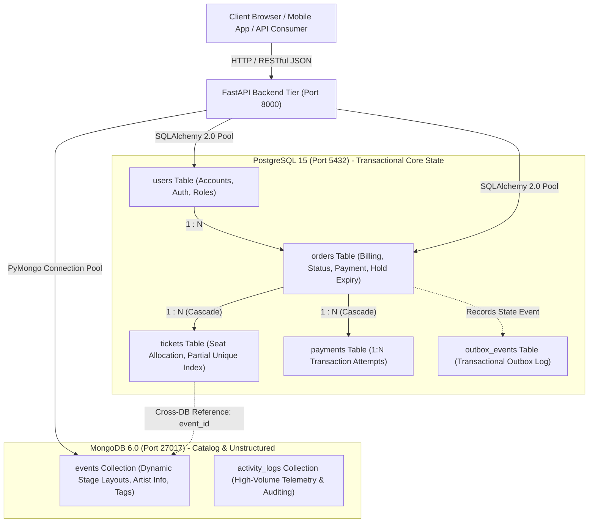

# 269340 Ticket Booking Platform — Checkpoint 1: Core Architecture & Dual-Database Model

A high-performance, production-grade Dual-Database backend API for concert, music event, and festival ticket booking. Built with **FastAPI**, **PostgreSQL** (ACID transactional core state), and **MongoDB** (flexible event catalog & telemetry).

---

## 1. Team Roster (4)

| Student ID | Full Name | Role |
| :--- | :--- | :--- |
| **670615022** | Natthakritta Aoktan | Backend Lead & Project Management|
| **670615027** | Nannapat Chaipoon | API Engineering & Request Validation |
| **670615029** | Poonyaporn Intaphrom | Data Engineering & Database Architecture |
| **670615032** | Pandara Yutiraksa | System Documentation & Frontend design |

---

## 2. System Architecture Diagram

```
 ┌────────────────┐
 │ Client Browser │
 └───────┬────────┘
         │ (HTTP / JSON API)
         ▼
 ┌────────────────┐
 │  Web API Tier  │
 │(FastAPI/Python)│
 └────┬──────┬────┘
      │      │ 
(Relational) │ (Document)
 ┌────┘      └────┐
 ▼                ▼
┌──────────────┐ ┌──────────────┐
│  PostgreSQL  │ │   MongoDB    │
│(Transactional│ │  (Catalog/   │
│ Core State)  │ │Unstructured) │
└──────────────┘ └──────────────┘
```

### Detailed Component Architecture



### Domain Boundary Separation:

| Database | Data | Why |
| :--- | :--- | :--- |
| **PostgreSQL** | `users`, `orders`, `tickets`, `payments`, `outbox_events` | Money and seat ownership need constraints, foreign keys and ACID transactions. |
| **MongoDB** | `events` (zones, prices, capacity, `booked_count`, nested artist and venue, free-form `dynamic_attributes`), `activity_logs` | Event documents vary in shape, and telemetry is high-volume and append-only. |

1. **PostgreSQL (Port 5432)**:
   - **Users**: Core user credentials, security hashes, and role-based access (`fan`, `organizer`, `admin`).
   - **Orders**: ACID transactional records preventing double charging and maintaining exact financial state.
   - **Tickets**: Discrete seat/zone records strictly linked to orders with unique ticket codes to prevent double-booking.
   
2. **MongoDB (Port 27017)**:
   - **Events**: Flexible JSON documents supporting heterogeneous stage zones, nested artist profiles, and arbitrary `dynamic_attributes` (age policies, stage specs, festival passes).
   - **ActivityLogs**: Append-only telemetry recording search behavior, checkout funnels, and interaction metrics.

---

## 3. Quick Start & Setup Instructions

### Prerequisites
- [Docker & Docker Compose](https://docs.docker.com/get-docker/)
- [Python 3.10+](https://www.python.org/)

### Step 1: Clone Repository & Configure Environment
```bash
git clone https://github.com/RowyMonkle/269340-Pruet_WebDev.git
cd 269340-Pruet_WebDev

# Copy environment file template
cp .env.example .env
```

### Step 2: Launch Services with Docker Compose

**full stack in Docker**
```bash
docker compose up --build -d
docker compose ps                           # wait until the databases show "healthy"
docker compose exec api alembic stamp head  # marks the schema created by init.sql as the baseline
docker compose exec api python seed.py      # seed both databases
```

### Step 3: Open the API
- Swagger UI: http://localhost:8000/docs
- ReDoc: http://localhost:8000/redoc
- Health check: http://localhost:8000/health (`200` when both databases respond, otherwise `503`)

   ### Seed data
`seed.py` clears and refills both databases, and prints the exact totals when it finishes.
   - **PostgreSQL:** 250 users, 500 orders, and their tickets, payments and outbox events (over 1,000 rows in total). Order totals equal the sum of their ticket prices, and ticket prices and zones match the Mongo events.
   - **MongoDB:** 200 events and 1,200 activity logs (1,400 documents). Logs reference real seeded user IDs.
   - The random seed is fixed (`42`), so every run produces the same data shape.

   ### Troubleshooting
- **`role "dev_user" does not exist` or a Mongo "connection refused" error.** Something else may be using port 5432 (for example a locally installed PostgreSQL service on Windows), or an old Docker volume was created with different credentials. Stop the local service, then reset:
  ```bash
  docker compose down -v
  docker compose up -d postgres_db mongo_db
  ```
- **`init.sql` changes are not applied.** The script only runs when the Postgres volume is empty, so run `docker compose down -v` first.
- **Ports.** Postgres uses 5432, MongoDB 27017 and the API 8000. Change the mapping in `docker-compose.yml` (and `.env`) if they are taken.

---


### Step 4: Run Automated Concurrency & Stress Tests
```bash
# Run inside Docker container (recommended):
docker compose exec api pytest tests/test_concurrency.py -v

# Or run locally if Python virtual environment is active:
pytest tests/test_concurrency.py -v
```
**Automated Test Scenarios Covered:**
1. `test_oversell_concurrency_protection`: 50 concurrent threads competing for 1 available seat. Exactly 1 order succeeds (`201`), and 49 are rejected (`409 Conflict`).
2. `test_same_seat_concurrency_protection`: 2 parallel requests trying to claim the exact same seat number. PostgreSQL partial unique index prevents double-booking (`409 Conflict`).
3. `test_idempotency_order_placement`: Repeated requests with identical `Idempotency-Key` return original order without double-booking or duplicate payments.
4. `test_idempotency_payload_mismatch`: Replaying an existing `Idempotency-Key` with altered payload parameters returns `409 Conflict`.
5. `test_paying_twice_fails_with_400`: First payment confirms order. Second payment attempt returns `400 Bad Request`.
6. `test_expiry_then_pay_fails_with_410`: Paying for an expired seat hold releases seats back to MongoDB and returns `410 Gone`.

---

## 4. API Endpoints Summary

| Method | Route | Target DB | Status | Description |
| :--- | :--- | :--- | :--- | :--- |
| `GET` | `/health` | Both | `200` / `503` | Verifies live connectivity to PostgreSQL and MongoDB |
| `POST` | `/api/v1/users` | PostgreSQL | `201`, `400`, `409` | Register user account (strictly forces fan role, hashes password) |
| `GET` | `/api/v1/users/{id}` | PostgreSQL | `200`, `404` | Fetch user details via `.options(load_only(...))` projection |
| `GET` | `/api/v1/users` | PostgreSQL | `200` | Paginated list of users (optimized projection, zero N+1 queries) |
| `GET` | `/api/v1/events` | MongoDB | `200` | Fetch paginated concert/festival catalog with field projections |
| `POST` | `/api/v1/events` | MongoDB | `201`, `400` | Create event document with nested dynamic attributes |
| `GET` | `/api/v1/events/{id}` | MongoDB | `200`, `404` | Fetch single event document by its ObjectId |
| `GET` | `/api/v1/products` | MongoDB | `200` | Catalog alias for /events |
| `POST` | `/api/v1/products` | MongoDB | `201` | Catalog alias for /events |
| `POST` | `/api/v1/orders` | Dual-DB | `201`, `400`, `409` | Atomic checkout with 10-min seat hold, `Idempotency-Key` header support |
| `GET` | `/api/v1/orders/{id}`| PostgreSQL | `200`, `404` | Fetch order details with associated tickets and payments (joinedload) |
| `POST` | `/api/v1/orders/{id}/payments` | PostgreSQL | `201`, `400` | Process payment, confirm order, activate tickets (`held` $\rightarrow$ `valid`) |
| `GET` | `/api/v1/orders/{id}/payments` | PostgreSQL | `200`, `404` | List payment transaction attempts for an order |
| `POST` | `/api/v1/orders/cleanup-expired` | Dual-DB | `200` | Reconcile and release expired seat holds back to MongoDB |

---

## 5. Architectural Directives & Patterns

### 1. Seat Holds & Expiry State Machine
Orders follow an industry-standard state machine:
$$\text{Pending (Held)} \xrightarrow{\text{Payment Complete}} \text{Confirmed (Valid)} \quad \Big| \quad \text{Pending (Held)} \xrightarrow{\text{10 min Timeout}} \text{Expired (Released)}$$
- During the 10-minute hold window, tickets are marked `held`.
- The PostgreSQL partial unique index `uq_tickets_event_zone_seat` protects seats in both `held` and `valid` states from double-booking.
- Background reconciliation automatically releases expired seats back to the MongoDB event capacity.

### 2. Transactional Outbox Pattern (Dual-DB Consistency)
To guarantee eventual consistency across PostgreSQL and MongoDB:
- Every state change writes an atomic event (`SEAT_HELD`, `ORDER_PAID`, `SEAT_HOLD_EXPIRED`) into the PostgreSQL `outbox_events` table within the same database transaction.
- An asynchronous worker processes outbox records to update MongoDB, ensuring network failures or crashes never leave the databases permanently out of sync.

### 3. Database Projections & Eliminating N+1 Bottlenecks
- **SQLAlchemy (PostgreSQL)**: All entity queries utilize `.options(load_only(...))` including `updated_at` so heavy or sensitive columns (e.g. `hashed_password`) are never loaded into memory, and no secondary lazy-load queries are triggered. Related ticket collections use `joinedload` to prevent N+1 query loops.
- **PyMongo (MongoDB)**: All collection queries use projection dictionaries (e.g. `{"_id": 1, "title": 1, "zones": 1, ...}`) to eliminate document over-fetching over the wire.

### 4. Zero-Downtime Schema Evolution (Expand and Contract Pattern)
All database schema alterations avoid table-locking operations:
1. **Expand**: Add new columns with `nullable=True` or safe default values alongside legacy fields.
2. **Dual Write**: API writes to both legacy and new schema versions concurrently.
3. **Backfill**: Background worker asynchronously migrates legacy records.
4. **Switch Read**: Read traffic shifts from old columns to new columns.
5. **Contract**: Safely drop deprecated columns only after previous application versions are fully decommissioned.

### 5. Git Hygiene & Security
- Strict `.gitignore` prevents tracking virtual environments (`.venv`), `.env` configuration files, database files (`*.db`, `*.sqlite`), and credentials.
- Pure ORM queries and parameterized SQL prevent SQL Injection vulnerabilities.
